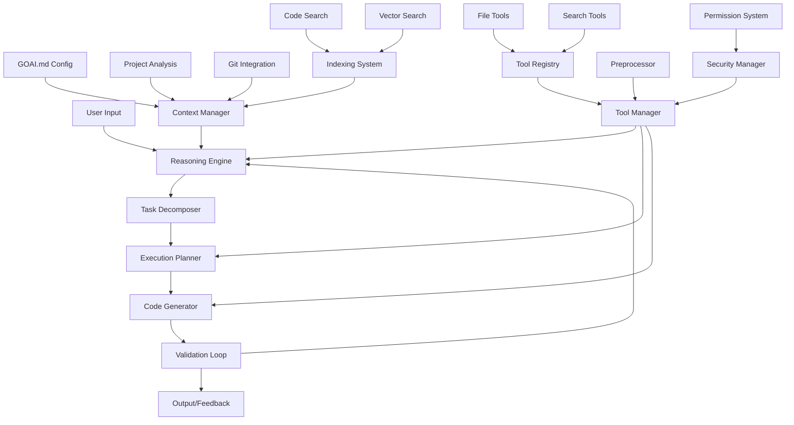
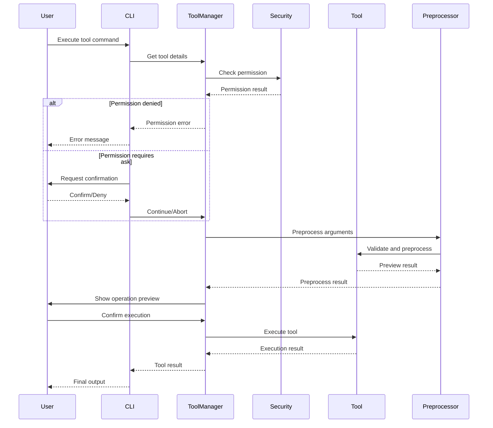

# GoAI Coder Design Document

## Overview

GoAI Coder is a reasoning-based programming assistant that leverages the Eino framework and includes a comprehensive tool system inspired by Continue's architecture. The system combines structured reasoning with practical tool execution capabilities, providing intelligent code analysis, generation, and problem-solving capabilities.

The system follows a reasoning-first architecture where complex programming tasks are broken down through structured analysis, planning, and iterative execution cycles, enhanced by a powerful tool system that can interact with files, search code, and execute system commands safely.

The core philosophy is to emulate human expert reasoning patterns - understanding the problem deeply, considering multiple approaches, creating detailed plans, and validating results through multiple feedback loops - while providing practical tools to actually implement solutions.

## Architecture

### High-Level Architecture



### Core Components

#### 1. Reasoning Engine
The central orchestrator that manages the entire reasoning process:
- **Problem Analyzer**: Breaks down user requirements into structured analysis
- **Context Integrator**: Incorporates project-specific context and constraints
- **Decision Maker**: Chooses appropriate strategies and approaches
- **Feedback Processor**: Learns from validation results to improve future reasoning

#### 2. Eino Framework Integration
Built on Eino's Chain and Graph composition patterns:
- **Reasoning Chains**: Sequential processing for linear reasoning tasks
- **Reasoning Graphs**: Parallel processing for complex multi-faceted analysis
- **Template System**: Structured prompts for consistent reasoning patterns
- **Model Orchestration**: Coordinated use of different AI models for specialized tasks

#### 3. Context Management System
Intelligent understanding of project environment:
- **Project Structure Analyzer**: Understands codebase organization and patterns
- **Configuration Loader**: Processes GOAI.md and other config files
- **Git Integration**: Tracks recent changes and development patterns
- **Dependency Analyzer**: Maps external libraries and their usage patterns

#### 4. Codebase Indexing and Search System
Advanced code understanding and retrieval capabilities inspired by Continue's architecture:
- **Codebase Indexer**: Main orchestrator for building and maintaining code indexes
- **Multi-Modal Indexing**: Document chunks, full-text search, symbol extraction, and vector embeddings
- **Hybrid Retrieval**: Combines FTS, semantic search, recent files, and symbol-based retrieval
- **Incremental Updates**: Efficient index maintenance with change detection and caching
- **Context-Aware Search**: Provides relevant code context for reasoning and generation

#### 5. Tool System Architecture
Comprehensive tool execution system inspired by Continue's tool architecture:
- **Tool Manager**: Central coordinator for tool execution and lifecycle management
- **Tool Registry**: Dynamic registration and discovery of available tools
- **Security Manager**: Permission checking and security validation
- **Preprocessor**: Tool argument validation and operation preview generation
- **Permission System**: Fine-grained access control with configurable policies

## Components and Interfaces

### Core Interfaces

```go
// Primary reasoning interface with tool support
type ReasoningEngine interface {
    AnalyzeProblem(ctx context.Context, req *ProblemRequest) (*Analysis, error)
    GeneratePlan(ctx context.Context, analysis *Analysis) (*ExecutionPlan, error)
    ExecutePlan(ctx context.Context, plan *ExecutionPlan) (*CodeResult, error)
    ValidateResult(ctx context.Context, result *CodeResult) (*ValidationReport, error)
    
    // New tool-related methods
    ExecuteTool(ctx context.Context, toolName string, args map[string]interface{}) (interface{}, error)
    GetAvailableTools() ([]ToolInfo, error)
}

// Context management interface
type ContextManager interface {
    BuildProjectContext(workdir string) (*ProjectContext, error)
    LoadConfiguration(configPath string) (*GOAIConfig, error)
    WatchFileChanges(callback func(*FileChangeEvent)) error
    GetRecentChanges(since time.Time) ([]*GitChange, error)
}

// Code generation interface
type CodeGenerator interface {
    GenerateCode(ctx context.Context, spec *CodeSpec) (*GeneratedCode, error)
    GenerateTests(ctx context.Context, code *GeneratedCode) (*TestSuite, error)
    GenerateDocumentation(ctx context.Context, code *GeneratedCode) (*Documentation, error)
}

// Validation interface
type Validator interface {
    StaticAnalysis(code *GeneratedCode) (*StaticReport, error)
    RunTests(testSuite *TestSuite) (*TestResults, error)
    CheckCompliance(code *GeneratedCode, standards *CodingStandards) (*ComplianceReport, error)
}

// Codebase indexing and search interfaces
type CodebaseIndexer interface {
    // Index lifecycle management
    BuildIndex(ctx context.Context, workdir string) error
    RefreshIndex(ctx context.Context, paths []string) error
    ClearIndex(ctx context.Context, workdir string) error
    
    // Index status
    GetIndexStatus(workdir string) (*IndexStatus, error)
    IsIndexReady(workdir string) bool
    WaitForIndex(ctx context.Context, workdir string) error
    
    // Search and retrieval
    Search(ctx context.Context, req *SearchRequest) (*SearchResult, error)
    GetContextItems(ctx context.Context, query string, opts *ContextOptions) ([]*ContextItem, error)
}

// Index implementation interface
type Index interface {
    Name() string
    Version() string
    
    Update(ctx context.Context, tag *IndexTag, changes *IndexChanges) error
    Remove(ctx context.Context, tag *IndexTag, files []string) error
    Search(ctx context.Context, query string, opts *SearchOptions) ([]*SearchResult, error)
}

// Retrieval pipeline interface
type RetrievalPipeline interface {
    Run(ctx context.Context, req *RetrievalRequest) (*RetrievalResponse, error)
    AddRetriever(retriever Retriever)
    SetReranker(reranker Reranker)
}

// Individual retriever interface
type Retriever interface {
    Name() string
    Retrieve(ctx context.Context, query string, opts *RetrieveOptions) ([]*Chunk, error)
    CanHandle(query string) bool
    Priority() int
}

// Tool management interfaces
type ToolManager interface {
    RegisterTool(tool Tool) error
    UnregisterTool(toolName string) error
    GetTool(toolName string) (Tool, error)
    ListTools() ([]ToolInfo, error)
    
    ExecuteTool(ctx context.Context, toolName string, args map[string]interface{}) (interface{}, error)
    PreprocessTool(toolName string, args map[string]interface{}) (*PreprocessResult, error)
    
    // Permission management
    CheckPermission(toolName string, args map[string]interface{}) (PermissionLevel, error)
    LoadPermissionPolicies(policies []PermissionPolicy) error
}

// Tool interface inspired by Continue
type Tool interface {
    Name() string
    DisplayName() string
    Description() string
    Parameters() map[string]ParameterSchema
    
    Preprocess(ctx context.Context, args map[string]interface{}) (*PreprocessResult, error)
    Execute(ctx context.Context, args map[string]interface{}) (interface{}, error)
    Validate(args map[string]interface{}) error
    
    ReadOnly() bool
    IsBuiltIn() bool
}
```

### Data Models

#### Core Data Structures

```go
type ProblemRequest struct {
    Description     string            `json:"description"`
    Context         *ProjectContext   `json:"context"`
    Requirements    []string          `json:"requirements"`
    Constraints     []string          `json:"constraints"`
    PreferredStyle  *CodingStyle      `json:"preferred_style"`
}

type Analysis struct {
    ProblemDomain   string            `json:"problem_domain"`
    TechnicalStack  []string          `json:"technical_stack"`
    ArchitecturePattern string        `json:"architecture_pattern"`
    RiskFactors     []RiskFactor      `json:"risk_factors"`
    Recommendations []Recommendation  `json:"recommendations"`
    Complexity      ComplexityLevel   `json:"complexity"`
}

type ExecutionPlan struct {
    Steps           []PlanStep        `json:"steps"`
    Dependencies    []Dependency      `json:"dependencies"`
    Timeline        *Timeline         `json:"timeline"`
    TestStrategy    *TestStrategy     `json:"test_strategy"`
    ValidationRules []ValidationRule  `json:"validation_rules"`
}

type ProjectContext struct {
    WorkingDirectory string           `json:"working_directory"`
    ProjectConfig    *GOAIConfig      `json:"project_config"`
    ProjectStructure *ProjectStructure `json:"project_structure"`
    RecentChanges    []*GitChange     `json:"recent_changes"`
    Dependencies     []*Dependency    `json:"dependencies"`
    OpenFiles        []*FileInfo      `json:"open_files"`
    CodingStandards  *CodingStandards `json:"coding_standards"`
    LoadedAt         time.Time        `json:"loaded_at"`
    GitInfo          *GitInfo         `json:"git_info"`
    
    // New fields for tool system
    ToolPermissions  []PermissionPolicy `json:"tool_permissions"`
    SecurityConfig   *SecurityConfig    `json:"security_config"`
    AvailableTools   []ToolInfo         `json:"available_tools"`
}

// Indexing and search data models
type IndexTag struct {
    Directory   string    `json:"directory"`
    Branch      string    `json:"branch"`
    ArtifactID  string    `json:"artifact_id"`
    LastUpdated time.Time `json:"last_updated"`
}

type IndexChanges struct {
    Added    []*FileInfo `json:"added"`
    Modified []*FileInfo `json:"modified"`
    Removed  []string    `json:"removed"`
}

type Chunk struct {
    ID        string            `json:"id"`
    FilePath  string            `json:"file_path"`
    Content   string            `json:"content"`
    StartLine int               `json:"start_line"`
    EndLine   int               `json:"end_line"`
    Language  string            `json:"language"`
    ChunkType ChunkType         `json:"chunk_type"`
    Metadata  map[string]interface{} `json:"metadata,omitempty"`
    Embedding []float32         `json:"embedding,omitempty"`
    Hash      string            `json:"hash"`
    Score     float64           `json:"score,omitempty"`
}

type ChunkType string

const (
    ChunkTypeDocument  ChunkType = "document"
    ChunkTypeFunction  ChunkType = "function"
    ChunkTypeClass     ChunkType = "class"
    ChunkTypeStruct    ChunkType = "struct"
    ChunkTypeInterface ChunkType = "interface"
    ChunkTypeComment   ChunkType = "comment"
)

type SearchRequest struct {
    Query           string                 `json:"query"`
    WorkspaceDir    string                 `json:"workspace_dir"`
    FilterDirectory string                 `json:"filter_directory,omitempty"`
    Languages       []string               `json:"languages,omitempty"`
    ChunkTypes      []ChunkType            `json:"chunk_types,omitempty"`
    Limit           int                    `json:"limit"`
    Options         map[string]interface{} `json:"options,omitempty"`
}

type SearchResult struct {
    Chunks          []*Chunk              `json:"chunks"`
    TotalCount      int                   `json:"total_count"`
    SearchTime      time.Duration         `json:"search_time"`
    RetrievalMethod string                `json:"retrieval_method"`
    Metadata        map[string]interface{} `json:"metadata,omitempty"`
}

type ContextItem struct {
    Name        string                 `json:"name"`
    Description string                 `json:"description"`
    Content     string                 `json:"content"`
    URI         *URI                   `json:"uri"`
    Metadata    map[string]interface{} `json:"metadata,omitempty"`
}

type RetrievalRequest struct {
    Query           string    `json:"query"`
    WorkspaceDir    string    `json:"workspace_dir"`
    FilterDirectory string    `json:"filter_directory,omitempty"`
    Languages       []string  `json:"languages,omitempty"`
    MaxResults      int       `json:"max_results"`
}

type RetrievalResponse struct {
    Chunks     []*Chunk              `json:"chunks"`
    TotalCount int                   `json:"total_count"`
    Duration   time.Duration         `json:"duration"`
    Metadata   map[string]interface{} `json:"metadata,omitempty"`
}

// Tool system data models
type ToolInfo struct {
    Name        string                 `json:"name"`
    DisplayName string                 `json:"display_name"`
    Description string                 `json:"description"`
    Parameters  map[string]ParameterSchema `json:"parameters"`
    ReadOnly    bool                   `json:"readonly"`
    BuiltIn     bool                   `json:"builtin"`
}

type ParameterSchema struct {
    Type        string      `json:"type"`
    Description string      `json:"description"`
    Required    bool        `json:"required"`
    Default     interface{} `json:"default,omitempty"`
}

type PreprocessResult struct {
    Preview       string                 `json:"preview"`
    ProcessedArgs map[string]interface{} `json:"processed_args"`
    Warnings      []string               `json:"warnings"`
    RequiresAuth  bool                   `json:"requires_auth"`
}

// Permission system data models
type PermissionLevel int

const (
    PermissionAllow PermissionLevel = iota
    PermissionAsk
    PermissionDeny
)

type PermissionPolicy struct {
    ToolPattern   string                 `json:"tool_pattern"`
    Permission    PermissionLevel        `json:"permission"`
    ArgumentRules map[string]interface{} `json:"argument_rules,omitempty"`
    Description   string                 `json:"description"`
}

type SecurityConfig struct {
    Policies          []PermissionPolicy `json:"policies"`
    DefaultPermission PermissionLevel    `json:"default_permission"`
    AskTimeout        time.Duration      `json:"ask_timeout"`
}
```

### Codebase Indexing System Architecture

The indexing system follows a 6-layer architecture inspired by Continue's design, providing comprehensive code understanding and retrieval capabilities.

#### Layer 1: File Discovery
- **DirectoryWalker**: Recursively traverses project directories
- **FileFilter**: Applies ignore patterns (.goaiignore, .gitignore)
- **LanguageDetector**: Identifies programming languages and file types

#### Layer 2: Index Management  
- **CodebaseIndexer**: Main orchestrator managing all indexing operations
- **IndexScheduler**: Coordinates indexing tasks and manages concurrency
- **IndexLock**: Prevents concurrent indexing conflicts

#### Layer 3: Index Implementations
- **ChunkIndex**: Document chunking and basic storage
- **FullTextIndex**: SQLite FTS5-based full-text search with BM25 ranking
- **SymbolIndex**: Code structure analysis using tree-sitter parsers
- **EmbeddingIndex**: Vector embeddings for semantic search

#### Layer 4: Storage Backend
- **SQLite**: Metadata, chunks, and FTS indexes
- **BadgerDB**: Key-value storage for embeddings and cache
- **CacheManager**: Multi-level caching (memory, disk, remote)

#### Layer 5: Retrieval Layer
Multiple specialized retrievers work in parallel:

```go
// Full-text search retriever using SQLite FTS5
type FTSRetriever struct {
    db               *sql.DB
    pathWeightMultiplier float64
}

// Semantic search using vector embeddings
type SemanticRetriever struct {
    embeddingProvider EmbeddingProvider
    vectorDB         VectorDB
}

// Recently edited files from LRU cache
type RecentFilesRetriever struct {
    lruCache *LRUCache
    fileWatcher *FileWatcher
}

// Code symbols and structure
type SymbolRetriever struct {
    symbolIndex *SymbolIndex
    parser      *TreeSitterParser
}
```

#### Layer 6: Retrieval Pipelines
Orchestrates multiple retrievers and applies ranking:

```go
// Hybrid pipeline combining multiple retrieval methods
type HybridRetrievalPipeline struct {
    retrievers []Retriever
    reranker   Reranker
    options    *PipelineOptions
}

func (p *HybridRetrievalPipeline) Run(ctx context.Context, req *RetrievalRequest) (*RetrievalResponse, error) {
    // Phase 1: Parallel retrieval from multiple sources
    initialResults := p.runParallelRetrieval(ctx, req)
    
    // Phase 2: Reranking and score fusion (if enabled)
    if p.reranker != nil {
        return p.runReranking(ctx, req.Query, initialResults)
    }
    
    // Phase 3: Weighted merging and deduplication
    return p.runWeightedMerging(initialResults), nil
}
```

### Integration with Reasoning System

The indexing system integrates seamlessly with the reasoning engine:

```go
// Enhanced context manager with indexing capabilities
type ContextManager interface {
    BuildProjectContext(workdir string) (*ProjectContext, error)
    LoadConfiguration(configPath string) (*GOAIConfig, error)
    WatchFileChanges(callback func(*FileChangeEvent)) error
    GetRecentChanges(since time.Time) ([]*GitChange, error)
    
    // New indexing-powered methods
    SearchRelevantCode(ctx context.Context, query string) ([]*ContextItem, error)
    GetSemanticContext(ctx context.Context, task *ProblemRequest) ([]*Chunk, error)
    FindSimilarPatterns(ctx context.Context, codeSnippet string) ([]*Chunk, error)
}

// Problem analysis now includes code context retrieval
func NewEnhancedProblemAnalysisChain(contextMgr ContextManager) *compose.Chain[ProblemRequest, *Analysis] {
    return compose.NewChain[ProblemRequest, *Analysis]().
        AppendFunction(func(ctx context.Context, req *ProblemRequest) (*ProblemRequest, error) {
            // Retrieve relevant code context using indexing system
            relevantCode, err := contextMgr.SearchRelevantCode(ctx, req.Description)
            if err == nil && len(relevantCode) > 0 {
                req.Context.RelevantCode = relevantCode
            }
            return req, nil
        }).
        AppendChatTemplate(analysisTemplate).
        AppendChatModel(getAnalysisModel()).
        Compile(ctx)
}
```

### Tool System Architecture

The tool system provides comprehensive file operation, code search, and system interaction capabilities with security controls.

#### Tool Types and Capabilities

**File Operation Tools**:
- `readFileTool`: Secure file reading with line number support and access validation
- `writeFileTool`: File creation and writing with directory traversal protection
- `editTool`: Precise string replacement editing with diff preview
- `multiEditTool`: Batch file editing operations with atomic transactions

**Code Search Tools**:
- `searchCodeTool`: Intelligent code search with regex support and language filtering
- `listFilesTool`: Directory listing with ignore pattern support
- `viewDiffTool`: Git diff viewing and comparison with syntax highlighting

**System Interaction Tools**:
- `runCommandTool`: Secure terminal command execution with timeout controls
- `fetchTool`: HTTP requests with URL validation and response size limits

#### Tool Execution Pipeline



#### Security and Permission System

**Permission Levels**:
- `PermissionAllow`: Automatic execution without user confirmation
- `PermissionAsk`: Request user confirmation before execution
- `PermissionDeny`: Block execution completely

**Security Validations**:
```go
// File access security validation
func ValidateFileAccess(filePath, baseDir string) error {
    // Convert to absolute path and clean
    cleanedPath := filepath.Clean(filePath)
    
    // Check directory traversal
    if !strings.HasPrefix(cleanedPath, baseDir) {
        return fmt.Errorf("access denied: file outside project directory")
    }
    
    // Check sensitive file patterns
    if isSensitiveFile(cleanedPath) {
        return fmt.Errorf("access denied: sensitive file")
    }
    
    return nil
}

// Command execution safety checks
func isDangerousCommand(command string) bool {
    dangerousPatterns := []string{
        "rm -rf", "sudo", "chmod 777", "mkfs", "fdisk",
        "format", "del /f", "rmdir /s", "> /dev/",
    }
    
    command = strings.ToLower(command)
    for _, pattern := range dangerousPatterns {
        if strings.Contains(command, pattern) {
            return true
        }
    }
    return false
}
```

#### Tool Integration with Reasoning Engine

```go
// Enhanced reasoning engine with tool execution capabilities
func (e *ReasoningEngine) ExecutePlan(ctx context.Context, plan *ExecutionPlan) (*CodeResult, error) {
    for _, step := range plan.Steps {
        // Check if step requires tool execution
        if step.ToolName != "" {
            result, err := e.toolManager.ExecuteTool(ctx, step.ToolName, step.ToolArgs)
            if err != nil {
                return nil, fmt.Errorf("tool execution failed: %w", err)
            }
            
            // Incorporate tool result into step result
            step.Result = result
        }
        
        // Continue with step processing...
    }
    
    return &CodeResult{Steps: plan.Steps}, nil
}
```

### Eino Chain Implementations

#### Problem Analysis Chain

```go
func NewProblemAnalysisChain() *compose.Chain[ProblemRequest, *Analysis] {
    systemPrompt := prompt.SystemMessage(`You are a senior software architect specializing in Go development. 
    Analyze programming problems using this structured approach:
    
    1. Problem Domain Analysis: Identify the core domain and business context
    2. Technical Challenge Assessment: Evaluate complexity and technical hurdles  
    3. Architecture Pattern Recommendation: Suggest appropriate design patterns
    4. Implementation Strategy: Outline step-by-step approach
    5. Risk Assessment: Identify potential issues and mitigation strategies
    
    Consider Go language idioms, performance characteristics, and ecosystem best practices.`)
    
    userPrompt := prompt.UserMessage(`Analyze this programming requirement:
    
    Description: {{.description}}
    Project Context: {{.context}}
    Requirements: {{.requirements}}
    Constraints: {{.constraints}}
    
    Provide structured analysis following the framework above.`)
    
    return compose.NewChain[ProblemRequest, *Analysis]().
        AppendChatTemplate(prompt.FromMessages(systemPrompt, userPrompt)).
        AppendChatModel(getAnalysisModel()).
        AppendFunction(parseAnalysisResponse).
        Compile(ctx)
}
```

#### Execution Planning Chain

```go
func NewExecutionPlanningChain() *compose.Chain[Analysis, *ExecutionPlan] {
    systemPrompt := prompt.SystemMessage(`Based on the problem analysis, create a detailed execution plan:
    
    1. Project Structure: Directory organization and file layout
    2. Core Components: Main modules and interface definitions
    3. Data Flow: How information moves through the system
    4. Implementation Sequence: Recommended development order
    5. Testing Strategy: Unit, integration, and validation approaches
    6. Deployment Considerations: Build and deployment requirements
    
    Prioritize incremental development with early validation points.`)
    
    userPrompt := prompt.UserMessage(`Create execution plan for:
    
    Analysis: {{.analysis}}
    
    Provide detailed, actionable steps with clear dependencies and validation points.`)
    
    return compose.NewChain[Analysis, *ExecutionPlan]().
        AppendChatTemplate(prompt.FromMessages(systemPrompt, userPrompt)).
        AppendChatModel(getPlanningModel()).
        AppendFunction(parseExecutionPlan).
        Compile(ctx)
}
```

### Reasoning Graph for Parallel Processing

```go
func NewReasoningGraph() *compose.Graph[ReasoningRequest, ReasoningResponse] {
    return compose.NewGraph[ReasoningRequest, ReasoningResponse]().
        // Parallel Analysis Phase
        AddNode("syntax_analysis", createSyntaxAnalyzer()).
        AddNode("semantic_analysis", createSemanticAnalyzer()).
        AddNode("context_extraction", createContextExtractor()).
        AddNode("dependency_analysis", createDependencyAnalyzer()).
        
        // Planning Phase
        AddNode("architecture_planning", createArchitecturePlanner()).
        AddNode("step_planning", createStepPlanner()).
        AddNode("risk_assessment", createRiskAssessor()).
        
        // Generation Phase
        AddNode("code_generation", createCodeGenerator()).
        AddNode("test_generation", createTestGenerator()).
        AddNode("doc_generation", createDocumentationGenerator()).
        
        // Validation Phase
        AddNode("static_analysis", createStaticAnalyzer()).
        AddNode("dynamic_testing", createDynamicTester()).
        AddNode("compliance_check", createComplianceChecker()).
        
        // Define execution flow
        AddEdge("syntax_analysis", "architecture_planning").
        AddEdge("semantic_analysis", "architecture_planning").
        AddEdge("context_extraction", "step_planning").
        AddEdge("dependency_analysis", "risk_assessment").
        
        AddEdge("architecture_planning", "code_generation").
        AddEdge("step_planning", "code_generation").
        AddEdge("risk_assessment", "code_generation").
        
        AddEdge("code_generation", "test_generation").
        AddEdge("code_generation", "doc_generation").
        
        AddEdge("test_generation", "static_analysis").
        AddEdge("doc_generation", "compliance_check").
        AddEdge("static_analysis", "dynamic_testing").
        
        Compile(ctx)
}
```

## Error Handling

### Error Categories

1. **Input Validation Errors**: Invalid user input or malformed requests
2. **Context Loading Errors**: Issues reading project files or configuration
3. **Analysis Errors**: Problems during reasoning or planning phases
4. **Generation Errors**: Code generation failures or template issues
5. **Validation Errors**: Static analysis or test execution failures
6. **System Errors**: Infrastructure or dependency issues

### Error Handling Strategy

```go
type GoAIError struct {
    Code        ErrorCode     `json:"code"`
    Message     string        `json:"message"`
    Context     interface{}   `json:"context,omitempty"`
    Suggestions []string      `json:"suggestions,omitempty"`
    Recoverable bool          `json:"recoverable"`
}

func (e *GoAIError) Error() string {
    return fmt.Sprintf("[%s] %s", e.Code, e.Message)
}

// Error recovery mechanisms
type ErrorRecovery interface {
    CanRecover(err *GoAIError) bool
    Recover(ctx context.Context, err *GoAIError) (*RecoveryResult, error)
    SuggestAlternatives(err *GoAIError) []Alternative
}
```

### Graceful Degradation

- **Partial Results**: Return partial analysis when complete processing fails
- **Fallback Strategies**: Use simpler approaches when advanced reasoning fails
- **User Guidance**: Provide clear error messages with actionable suggestions
- **Retry Mechanisms**: Automatic retry with exponential backoff for transient errors

## Testing Strategy

### Unit Testing

- **Chain Testing**: Validate individual Eino chains with mock inputs
- **Component Testing**: Test core components in isolation
- **Error Path Testing**: Verify error handling and recovery mechanisms
- **Performance Testing**: Ensure chains complete within acceptable time limits

### Integration Testing

- **End-to-End Workflows**: Test complete reasoning cycles from input to output
- **Context Integration**: Verify project context loading and usage
- **CLI Integration**: Test command-line interface with various scenarios
- **File System Integration**: Test project analysis and file operations

### Validation Testing

- **Code Quality**: Generated code meets quality standards
- **Correctness**: Generated code compiles and passes tests
- **Compliance**: Output follows project coding standards
- **Performance**: Generated code meets performance requirements

### Test Data Management

```go
type TestScenario struct {
    Name            string              `json:"name"`
    Description     string              `json:"description"`
    Input           *ProblemRequest     `json:"input"`
    ExpectedOutput  *ExpectedResult     `json:"expected_output"`
    ValidationRules []ValidationRule    `json:"validation_rules"`
    Context         *TestContext        `json:"context"`
}

type TestSuite struct {
    Scenarios       []TestScenario      `json:"scenarios"`
    SetupScripts    []string            `json:"setup_scripts"`
    TeardownScripts []string            `json:"teardown_scripts"`
    Environment     *TestEnvironment    `json:"environment"`
}
```

### Continuous Validation

- **Regression Testing**: Ensure new changes don't break existing functionality
- **Performance Monitoring**: Track reasoning speed and resource usage
- **Quality Metrics**: Monitor generated code quality over time
- **User Feedback Integration**: Incorporate user feedback into test scenarios