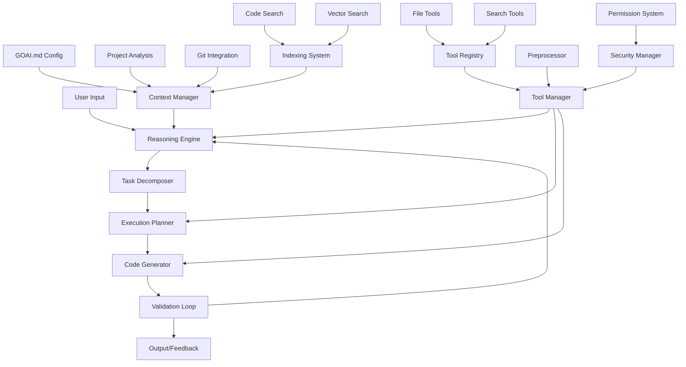
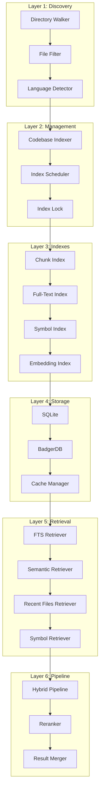
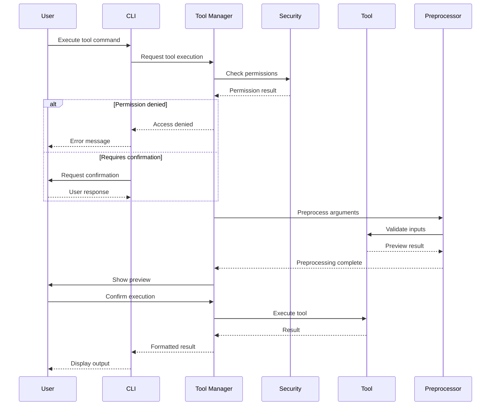

# GoAI Coder

[](https://github.com/Zerofisher/goai/actions/workflows/test.yml)
[](https://codecov.io/gh/Zerofisher/goai)
[](https://github.com/Zerofisher/goai)
[](https://opensource.org/licenses/MIT)

A reasoning-based programming assistant CLI tool built in Go that provides intelligent code generation, analysis, and problem-solving capabilities with a focus on context-aware assistance.

## Features

- **Reasoning-First Architecture**: Uses structured reasoning chains to understand problems deeply before generating solutions
- **Intelligent Code Analysis**: Analyzes programming problems through multi-step reasoning processes
- **Execution Planning**: Generates detailed implementation plans with dependency management
- **Code Generation**: Creates production-ready code with proper error handling and tests
- **Code Validation**: Performs comprehensive validation including static analysis and testing
- **Project Context**: Git integration, file watching, and project structure analysis
- **Advanced Codebase Indexing**: Multi-modal search system with:
  - **Full-Text Search**: SQLite FTS5 with BM25 ranking for keyword matching
  - **Symbol Search**: Go AST-based symbol indexing for functions, types, and variables
  - **Semantic Search**: Vector embeddings with OpenAI integration for meaning-based retrieval
  - **Hybrid Retrieval**: Parallel multi-retriever system with intelligent reranking
  - **Recent Files**: Git-aware recent file tracking and context prioritization

## Architecture

GoAI Coder implements a sophisticated reasoning-based architecture that combines structured AI reasoning with practical tool execution capabilities.

### High-Level Architecture



### Core Components

#### 1. Four-Chain Reasoning System
Built on the [Eino framework](https://github.com/cloudwego/eino) with sequential reasoning chains:

1. **Analysis Chain**: Problem domain identification and technical challenge analysis
2. **Planning Chain**: Execution plan generation with step-by-step implementation
3. **Execution Chain**: Code generation with proper structure and testing
4. **Validation Chain**: Quality assurance and compliance checking

#### 2. Multi-Modal Indexing System
Comprehensive codebase understanding with:
- **Full-Text Search**: SQLite FTS5 with BM25 ranking
- **Symbol Search**: Go AST-based symbol indexing
- **Semantic Search**: Vector embeddings with OpenAI integration
- **Hybrid Retrieval**: Parallel multi-retriever system with intelligent reranking

#### 3. Tool System
Continue-inspired tool architecture providing:
- **File Operations**: Read, write, edit with security validation
- **Code Search**: Intelligent search with context inclusion
- **System Integration**: Safe command execution with permission controls
- **Permission Management**: Fine-grained access control with user confirmation

#### 4. Context Management
Intelligent project understanding through:
- **Project Structure Analysis**: Codebase organization and patterns
- **Git Integration**: Recent changes and development patterns
- **Configuration Loading**: GOAI.md and project-specific settings
- **Real-time Updates**: File watching and incremental indexing

## Installation

### Prerequisites

- Go 1.24.6 or later
- OpenAI API key (for LLM reasoning)

### Build from Source

```bash
git clone https://github.com/Zerofisher/goai.git
cd goai
go mod tidy
go build ./cmd/goai
```

## Usage

### Basic Commands

```bash
# Show help
./goai --help

# Analyze programming problems
./goai think "Create a REST API for user management"

# Generate execution plans
./goai plan analysis-result.json

# Analyze project structure
./goai analyze ./my-project

# Debug and fix issues
./goai fix "API returns 500 error on user creation"
```

### Configuration

**Required**: Set your OpenAI API key as an environment variable:

```bash
export OPENAI_API_KEY="your-api-key-here"
```

**Optional**: Configure custom OpenAI settings:

```bash
export OPENAI_BASE_URL="https://api.openai.com/v1"  # Custom API endpoint
export OPENAI_MODEL="gpt-4"                         # Custom model name
```

Create a `GOAI.md` file in your project directory with configuration:

```markdown
# Project Configuration
- **Language**: Go
- **Framework**: Gin/Echo
- **Testing**: Standard library + testify
- **Database**: PostgreSQL
```

### Example Usage

**Note**: Make sure to configure your OpenAI API key before running examples.

1. **Problem Analysis**:
   ```bash
   ./goai think "Build a microservice for processing payments"
   ```

2. **Project Analysis**:
   ```bash
   ./goai analyze ./payment-service
   ```

3. **Bug Fixing**:
   ```bash
   ./goai fix "Database connection pool exhausted"
   ```

## Testing

Run the comprehensive test suite:

```bash
# Run all tests
go test ./...

# Run tests with coverage
go test -cover ./...

# Generate coverage report
go test -coverprofile=coverage.out ./...
go tool cover -html=coverage.out -o coverage.html
```

## Code Quality

Ensure code quality with linting and static analysis:

```bash
# Run golangci-lint (recommended)
golangci-lint run

# Run specific linters
golangci-lint run --disable-all --enable=errcheck,staticcheck,gosec

# Run linter on specific package
golangci-lint run ./pkg/indexing

# Auto-fix some issues
golangci-lint run --fix

# Run go vet for basic static analysis
go vet ./...
```

Install golangci-lint if not already available:
```bash
# macOS
brew install golangci-lint

# Linux/Windows
curl -sSfL https://raw.githubusercontent.com/golangci/golangci-lint/master/install.sh | sh -s -- -b $(go env GOPATH)/bin
```

## Development

### Project Structure

```
goai/
├── cmd/goai/           # CLI entry point
├── internal/reasoning/ # Eino-based reasoning chains
├── pkg/
│   ├── types/         # Core data models and interfaces
│   ├── context/       # Project context management
│   ├── indexing/      # Codebase indexing and search
│   └── errors/        # Error handling utilities
└── .kiro/specs/       # Design documents and tasks
```

### Indexing System Architecture

The codebase indexing system follows a 6-layer architecture inspired by Continue's design:



### Tool System Pipeline

Security-first tool execution with comprehensive validation:



### Key Components

- **Reasoning Engine**: Four-chain system for problem-solving (Analysis → Planning → Execution → Validation)
- **Context Manager**: Project structure analysis, Git integration, and intelligent file watching
- **Enhanced Indexing System**: Multi-modal search with:
  - File discovery and intelligent chunking
  - SQLite FTS5 full-text search with BM25 ranking
  - Go AST symbol parsing and indexing
  - OpenAI vector embeddings for semantic search
  - Hybrid retrieval with parallel execution and reranking
  - Incremental updates and real-time synchronization
- **CLI Framework**: Cobra-based command structure with comprehensive help system

### Running Examples

Test the indexing system:
```bash
go run ./cmd/indexing-example
```

Test individual indexing components:
```bash
# Run enhanced indexing tests
go test ./pkg/indexing -v -run TestEnhancedIndexManager

# Test embedding functionality
go test ./pkg/indexing -v -run TestEmbeddingProvider

# Test retrieval system
go test ./pkg/indexing -v -run TestRetrievers

# Test tool system
go test ./pkg/tools -v

# Run with race detection
go test -race ./pkg/indexing ./pkg/tools
```

Test the full reasoning chain:
```bash
go run ./examples/full_reasoning_chain.go
```

### 🚀 Development Workflow

**Full Quality Check Pipeline:**
```bash
# 1. Run tests with coverage
go test -coverprofile=coverage.out ./...

# 2. Check code quality  
golangci-lint run

# 3. Verify build
go build ./cmd/goai

# 4. Generate coverage report (optional)
go tool cover -html=coverage.out -o coverage.html
```

**Pre-commit Quality Gate:**
```bash
# Quick quality check before committing
go test ./... && golangci-lint run && go build ./cmd/goai
```

### 🏗️ Implementation Guidelines

**Key Interface Locations:**
- Core interfaces: `pkg/types/interfaces.go`
- Reasoning engine: `internal/reasoning/engine.go`
- Context management: `pkg/context/manager.go`  
- Indexing system: `pkg/indexing/enhanced_manager.go`
- Tool system: `pkg/tools/manager.go`

**Development Best Practices:**
- All code must pass `golangci-lint run` with 0 issues
- Maintain test coverage above 60% for core packages
- Use proper error handling with defer patterns
- Follow Go idioms: interfaces in consumer packages
- Support concurrent operations with proper locking

## Contributing

1. Fork the repository
2. Create a feature branch (`git checkout -b feature/amazing-feature`)
3. Run the quality pipeline: `go test ./... && golangci-lint run`
4. Commit your changes (`git commit -m 'Add amazing feature'`)
5. Push to the branch (`git push origin feature/amazing-feature`)
6. Open a Pull Request

## Project Roadmap

### 📊 Implementation Status (5/16 Major Components Complete - 31.25%)

**✅ Phase 1: Foundation (Complete)**
- [x] Project foundation and core interfaces
- [x] Data models and validation system
- [x] Context management with Git integration
- [x] Eino-based reasoning chains (Analysis → Planning → Execution → Validation)
- [x] **Advanced Codebase Indexing System**:
  - [x] Multi-modal indexing (FTS5, symbols, vectors)
  - [x] Hybrid retrieval with parallel execution
  - [x] Enhanced index manager with all search capabilities
  - [x] Incremental updates and real-time synchronization

**🔄 Phase 2: Tool System (90% Complete)**
- [x] Tool manager and registry architecture
- [x] File operation tools (read, write, edit, multiEdit)
- [x] Code search tools with indexing integration
- [x] System interaction tools (command execution, HTTP)
- [ ] **Permission and security system** (In Progress)
  - [ ] User confirmation mechanisms
  - [ ] Fine-grained permission policies
  - [ ] Sensitive file protection

**🚧 Phase 3: CLI Interface (Next Priority)**
- [ ] Command handlers (think, plan, analyze, fix)
- [ ] Interactive planning mode
- [ ] Progress visualization and structured output
- [ ] Tool system CLI integration
- [ ] Help system and documentation

**📋 Phase 4: Advanced Features (Planned)**
- [ ] Parallel processing with Eino Graphs
- [ ] Bug analysis and fixing capabilities
- [ ] Project analysis and recommendations
- [ ] Comprehensive error handling and recovery
- [ ] Performance monitoring and debugging

**🔮 Phase 5: Extension & Distribution (Future)**
- [ ] Plugin system architecture
- [ ] Web UI interface
- [ ] Cross-platform packaging
- [ ] Documentation and examples
- [ ] Community tools and integrations

### 🎯 Current Focus Areas

1. **CLI Interface Implementation** - Enable user interaction with existing capabilities
2. **Security System Completion** - Ensure safe tool execution in production
3. **Performance Optimization** - Enhance indexing and search performance
4. **User Experience** - Interactive features and progress feedback

### 📈 Detailed Task Breakdown

<details>
<summary><strong>Phase 1: Foundation Components (✅ Complete)</strong></summary>

- **Task 1**: Project foundation and core interfaces
  - Go module structure with proper organization
  - Core interfaces: ReasoningEngine, ContextManager, CodeGenerator, Validator
  - Dependency management and error handling utilities

- **Task 2**: Data models and validation
  - Comprehensive data structures for all system components
  - JSON serialization/deserialization with validation
  - Type-safe interfaces and utility functions

- **Task 3**: Context management system
  - Project context loading with Git integration
  - GOAI.md configuration parser
  - File watching and real-time updates
  - Dependency analysis and project structure mapping

- **Task 4**: Eino-based reasoning chains
  - Four-chain reasoning system implementation
  - OpenAI integration with fallback mechanisms
  - Structured prompts and response parsing
  - Chain composition and error handling

- **Task 4.7**: Advanced indexing system
  - File discovery with .gitignore support
  - Multi-modal indexing (FTS5, symbols, embeddings)
  - Hybrid retrieval pipeline with reranking
  - Enhanced index manager with unified API
</details>

<details>
<summary><strong>Phase 2: Tool System (🔄 90% Complete)</strong></summary>

- **Task 4.5**: Core tool system (✅ Complete)
  - Tool manager interface and registry
  - File operation tools with security validation
  - Code search tools with indexing integration
  - System interaction tools with safety controls

- **Task 4.6**: Security and permission system (🚧 In Progress)
  - Permission policy framework
  - User confirmation interaction mechanisms
  - File access security validation
  - Command execution safety checks
</details>

<details>
<summary><strong>Phase 3: CLI Interface (📋 Next Priority)</strong></summary>

- **Task 6**: CLI interface and command handlers
  - Cobra-based command structure
  - Interactive planning mode with user choices
  - Progress indicators and structured output
  - Tool system integration with CLI commands
  - Comprehensive help and documentation system
</details>

### 🔧 Development Status by Component

| Component | Status | Coverage | Notes |
|-----------|--------|----------|-------|
| **Reasoning Engine** | ✅ Complete | 85% | Four chains with OpenAI integration |
| **Indexing System** | ✅ Complete | 90% | Production-ready multi-modal search |
| **Context Manager** | ✅ Complete | 80% | Git integration and file watching |
| **Tool System Core** | ✅ Complete | 85% | File ops, search, system tools |
| **Security System** | 🔄 In Progress | 40% | Permission policies needed |
| **CLI Interface** | 📋 Planned | 10% | Basic structure exists |
| **Error Handling** | 🔄 Partial | 60% | Core utilities implemented |
| **Testing Suite** | 🔄 Ongoing | 75% | Comprehensive test coverage |

## License

This project is licensed under the MIT License - see the [LICENSE](LICENSE) file for details.

### 🔄 Current Development Status

**Ready for Use:**
- ✅ Comprehensive indexing and search system
- ✅ Four-chain reasoning engine with OpenAI integration
- ✅ Core tool system with file operations
- ✅ Context management and Git integration

**In Development:**
- 🔧 Security and permission system completion
- 🔧 CLI interface implementation
- 🔧 Interactive user experience features

**Next Milestones:**
1. **CLI Interface** - Make tools accessible through command line
2. **Security System** - Complete permission policies and user confirmation
3. **Performance Optimization** - Enhanced search and indexing performance
4. **Documentation** - Comprehensive user guides and API documentation

## Acknowledgments

- Built on the [Eino framework](https://github.com/cloudwego/eino) by CloudWeGo
- Inspired by [Continue](https://continue.dev/) for code assistance patterns
- Uses [Cobra](https://github.com/spf13/cobra) for CLI framework
- Indexing architecture inspired by Continue's retrieval system
- Multi-modal search combining FTS, semantic, and symbol-based approaches